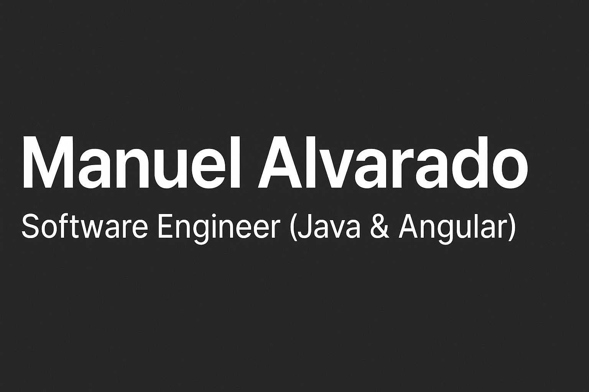

# 👋 Hey there, I'm **Manuel Alvarado**

🚀 **Software Engineer (Java & Angular)** | 💻 Full-Stack Developer | 🎶 Pianist turned Coder  

I’m a passionate **Software Engineer** who loves transforming complex ideas into clean, scalable systems.  
I specialize in **Java (Spring Boot)** and **Angular**, crafting high-performance applications that balance **engineering excellence and elegant design**.  
When I’m not coding, I’m either tuning pianos 🎹 or tuning APIs ⚙️.  

---

### 🧠 Quick Facts
- 💼 Currently working as **Full Stack Developer at Devintech**  
- 🌱 Constantly improving in **Cloud Architecture & Microservices**  
- 🔭 I love exploring **new frameworks** and building side projects  
- 🧩 Tech geek, perfectionist, and proud problem solver  

---

## 🛠️ Technology Stack

### 💡 Backend

### 🎨 Frontend

### 🧰 Tools & Platforms

### 🧑‍💻 Operating Systems

---

## 🧩 My Dev Philosophy

> “Code is like music — structure brings harmony,  
> and every line should sound clean and intentional.”

I believe that great software is built through **clarity, discipline, and passion**.  
Whether it’s designing architectures or debugging at 3 a.m., I approach every challenge like a melody to perfect.  

---

## 🏆 Achievements & Stats

---

## 🌐 Let's Connect

---

⭐ **“Keep learning. Keep building. Keep playing your code like a symphony.”**
