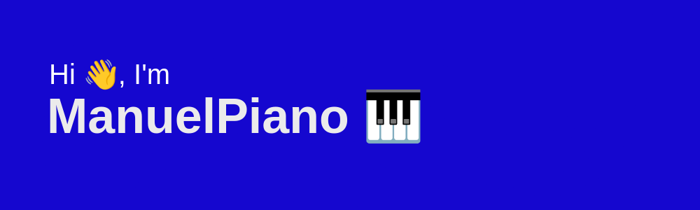

# Manuel Alvarado - Backend Java 

# Technology Stack💻

Hello there! 👋 I'm Manuel Alvarado, a Backend Developer with a passion for programming and continuous learning. I hold a degree in Computer Systems Engineering and work primarily with Java using the Spring Boot framework and PHP with the Laravel framework. Additionally, I have experience in frontend development using Bootstrap, HTML, and CSS.

## Skills

- Backend Development: Java (Spring Boot), PHP (Laravel), Python
- Frontend Development: Bootstrap, HTML, CSS
- Database Management: MySQL
- Version Control: Git
- Problem Solving
- Object-Oriented Programming (OOP)
- RESTful API Development
- Test-Driven Development (TDD)
- Agile Development Methodologies (Scrum)
- SOLID

<h3 align="left">Connect with me:</h3>

## About Me

I am passionate about coding and love to challenge myself with new projects. Being a self-taught developer, I enjoy exploring new technologies and expanding my knowledge every day. I believe in the power of collaboration and enjoy working in teams to deliver high-quality solutions.

In my free time, I like to explore open-source projects, contribute to the developer community, and stay up-to-date with the latest industry trends. I am an advocate for clean code and maintainable software design.

## Contact

If you have any questions, project inquiries, or just want to connect, feel free to reach out to me via:

- Email: (mailto:manuelalvarado3113@gmail.com)
- LinkedIn: (https://www.linkedin.com/in/manuelalvarado1/))
- GitHub: [GitHub Profile](https://github.com/ManuelPiano))

I'm always open to exciting opportunities and collaborations. Let's create something awesome together!
