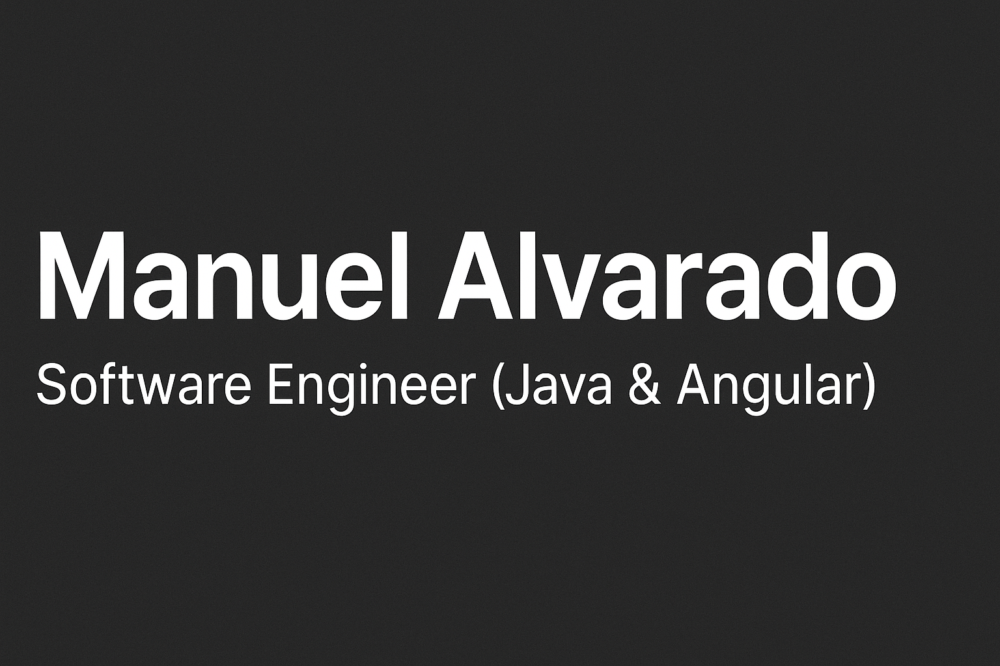

<!-- Professional Animated Text -->

  <b>Architecting scalable systems and delivering high-performance software solutions.</b> 
  Bridging the gap between robust backend engineering and elegant, user-centric interfaces.  Leveraging <b>Artificial Intelligence</b> to accelerate development cycles and optimize software architecture.

  

---

## 🚀 Professional Profile

- 💼 **Current Focus:** Delivering enterprise-grade applications as a Full Stack Developer.
- 🧠 **AI-Augmented Development:** Extensive use of AI integration (Claude, Codex, Open Design) for advanced code generation, architecture optimization, and intelligent project management.
- ⚙️ **Core Engineering:** Specializing in **Java (Spring Boot)** microservices and **Angular** single-page applications, alongside modern stacks like **React** and **NestJS**.
- 🌱 **Continuous Evolution:** Actively expanding expertise in Cloud Architecture, AI-driven UI/UX workflows, and distributed systems.
- 🎯 **Objective:** To build clean, maintainable, and highly scalable software that solves complex business problems efficiently.

---

## 🏗️ Current Initiatives

- ⚽ **GolAPPzo:** Architecting and developing a scalable mobile application ecosystem for the 2026 World Cup, focusing on real-time data integration.
- 📰 **Noticias La Paz Este:** Leading the technical strategy, platform architecture, and digital presence for a modern digital media outlet.

---

## 🛠️ Technology & AI Stack

| Domain | Technologies & Tools |
| :--- | :--- |
| 🤖 **AI & Workflow** |    |
| ⚙️ **Backend Core** |     |
| 🎨 **Frontend Core** |    |
| 📱 **Mobile & UI** |   |
| 🧰 **DevOps & Tools**|    |
| 🐧 **Environments** |   |

---

## 🎵 Engineering Philosophy

> *"Software architecture is like musical composition — structure brings harmony, and every component must be placed with strict intention."*

I approach software engineering with a commitment to **clarity, discipline, and performance**. By augmenting traditional development methodologies with modern AI tools, I focus on delivering clean codebases, optimizing performance bottlenecks, and shipping resilient products.

---

## 📈 GitHub Analytics

  

 

  
  

---

## 🌐 Let's Connect

  
  
  
  

